# WGAN

This repository and to see a hands-on comparison between normal DCGAN and WGAN.

TODO: Add WGAN-GP method and etc.

WGAN allows stable training and prevents mode collapse. Check [WGAN paper](https://arxiv.org/pdf/1701.07875.pdf).

---

### Install

Clone the repository and install required packages.

```bash
git clone https://github.com/yjang43/WassersteinGAN.git
cd WassersteinGAN/
pip install -r requirements.txt
```

### Usage

To train, you need wandb to track the result

```bash
python train.py
# wandb prompt
# enter '3' if you do not have wandb account
```

Run examples:

```bash
python train.py                               # default uses WGAN, CIFAR-10 
python train.py --dataset_name mnist --nc 1   # if MNIST, make sure to set nc to 1
python train.py --model_name dcgan            # change train model to DCGAN
python train.py --batch_size 32               # set batch size for GPU memory
```


### Result 
#### Losses and Inception Score on CIFAR-10

__DCGAN__

<p>
    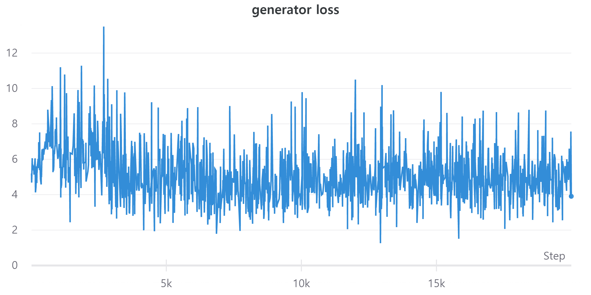
    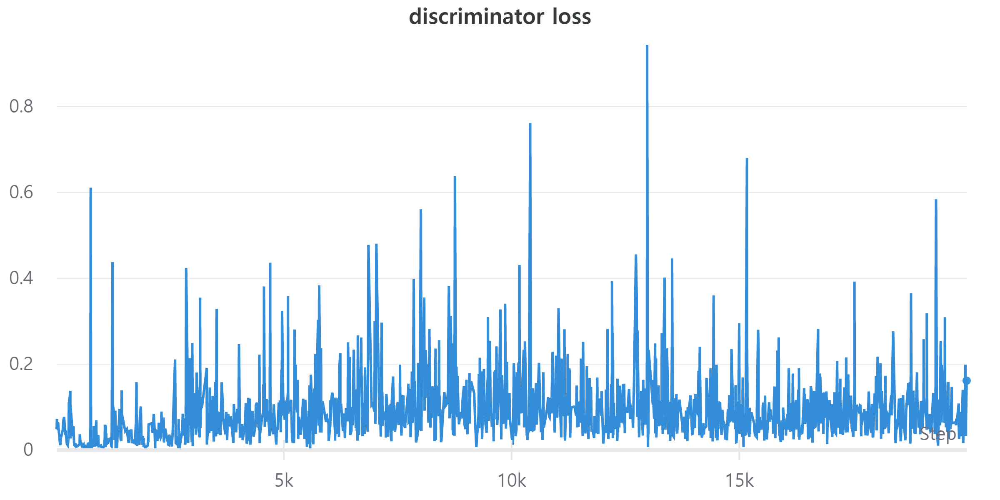
    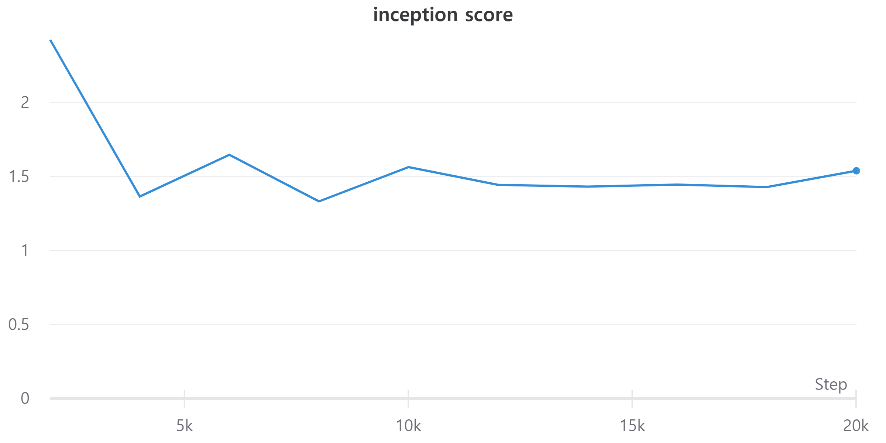
</p>

__WGAN__

<p>
    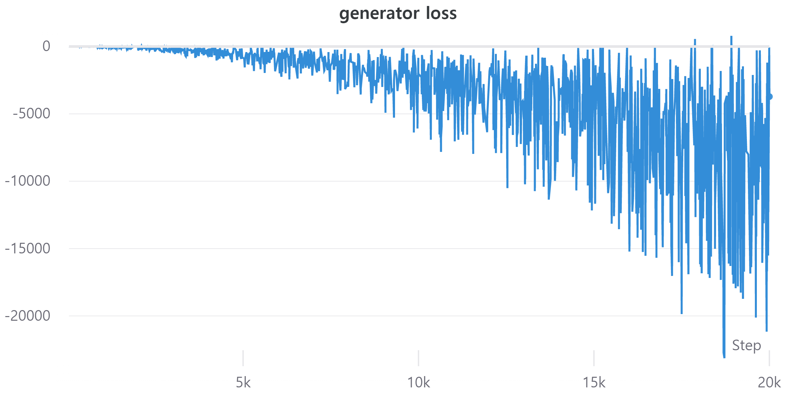
    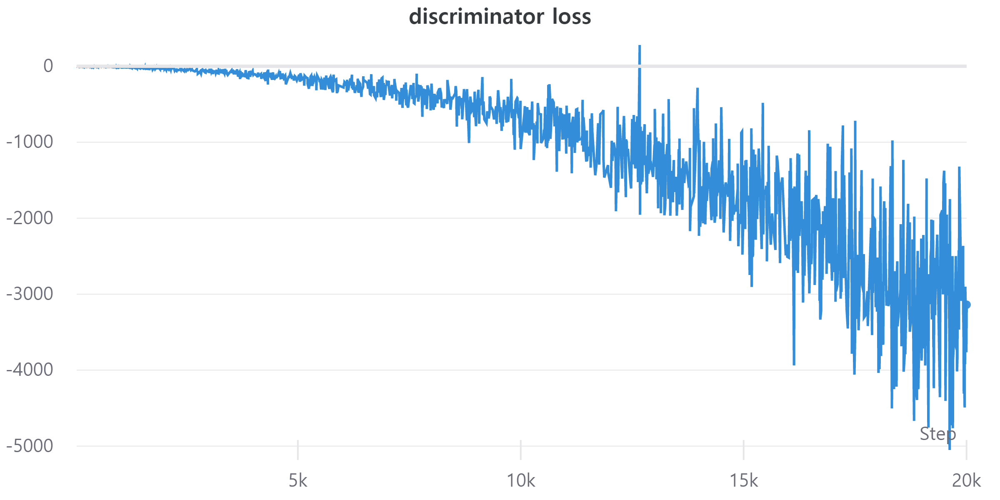
    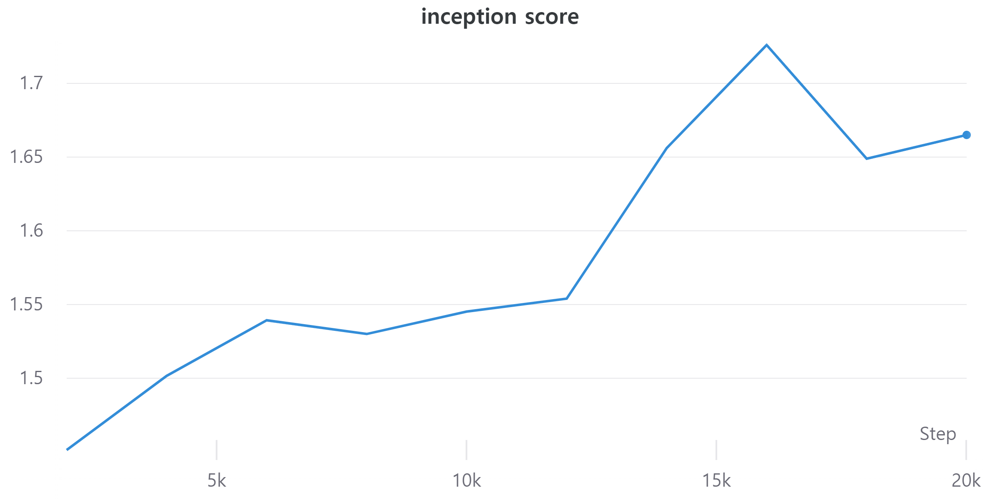
</p>

_inception score seems to be a bit off..._


#### Generated Images on CIFAR-10
DCGAN on the left and WGAN on the right

__500 itr__

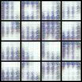
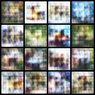

__2000 itr__

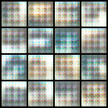
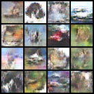

__5000 itr__

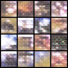
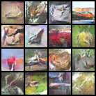

__20000 itr__<br>
Although not promising with small number of iteration, DCGAN image quality gets better

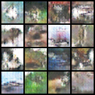
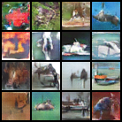


#### Generated Images on MNIST
DCGAN on the left and WGAN on the right

__500 itr__

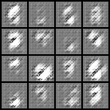
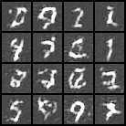

__2000 itr__

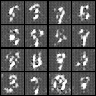
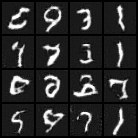

__5000 itr__

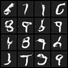
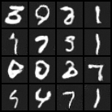


### Reference
__GAN__

https://github.com/Zeleni9/pytorch-wgan


__Inception Score v3__

https://github.com/sbarratt/inception-score-pytorch/blob/master/inception_score.py


